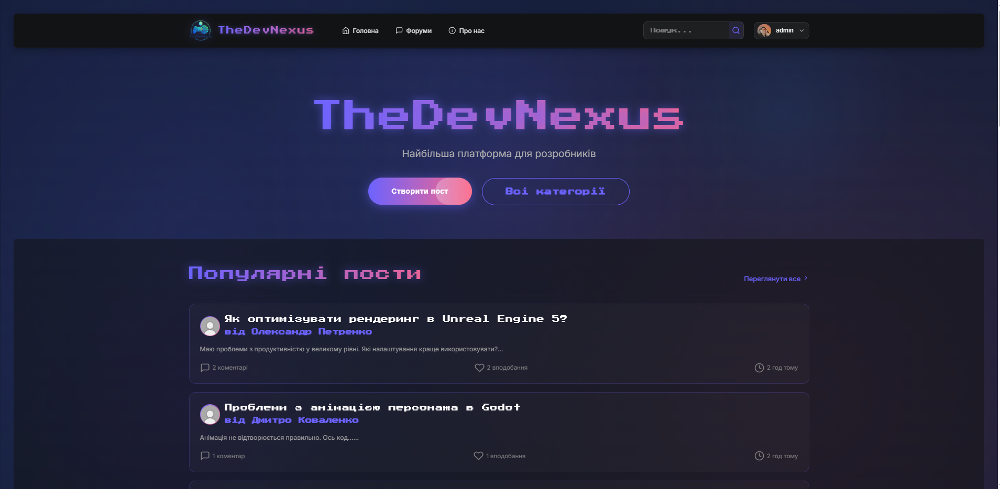
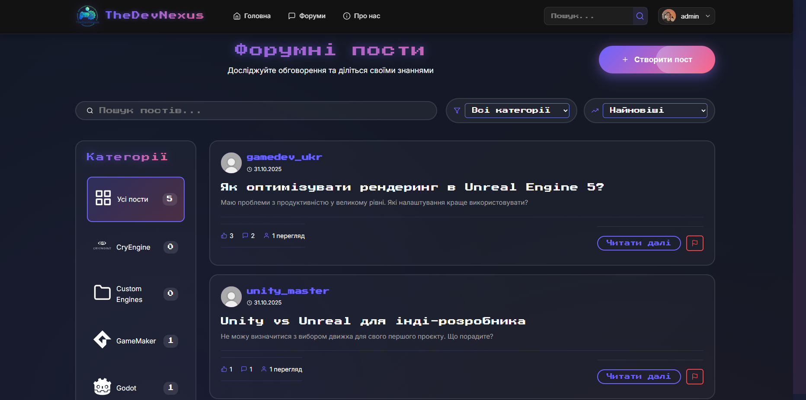
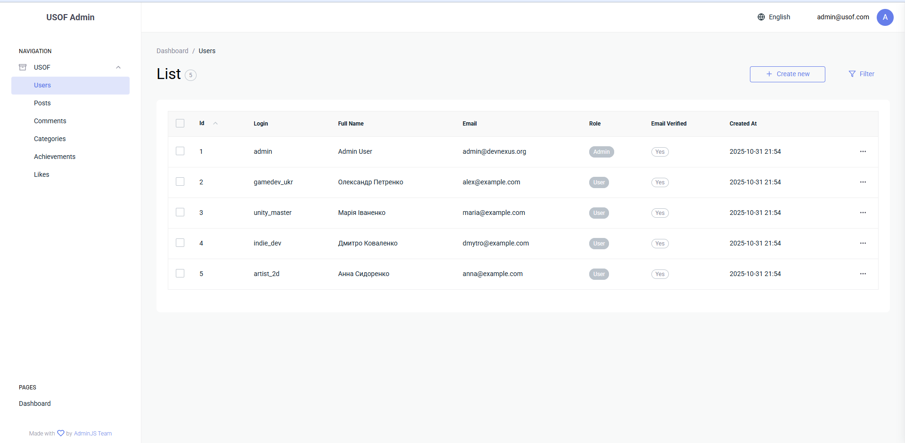

# TheDevNexus – Ukrainian GameDev & Modding Forum

## Overview
TheDevNexus is a full-stack community platform dedicated to Ukrainian-speaking game and mod developers. It combines a Node.js/Express REST API with a React SPA to deliver localized discussions, resource sharing, and collaborative tooling for teams working with engines such as Unreal Engine, Unity, Godot, Ren'Py, GameMaker, CryEngine, or custom OpenGL/Vulkan pipelines.

### Key Capabilities
- Localized forum experience (UA/EN/DE) with category-driven navigation and rich post formatting.
- Secure authentication flow with JWT-based sessions, password recovery, and admin moderation panel.
- Role-aware features including saved posts, reports, notifications, and content management mailers.
- Responsive UI themed around gamedev aesthetics with reusable modal, grid, and layout components.

## Screenshots
Screenshots are stored under `frontend/docs/screenshots/`.

| View | Preview |
| ---- | ------- |
| Home – Hero & Highlights |  |
| Forums – Post Listing |  |
| Post Detail – Discussion Thread |  |
| Admin Dashboard |  |

> Tip: capture fresh screenshots after major UI updates to keep the gallery current.

## Requirements & Dependencies

### System Requirements
- **Node.js** v18 or later (backend & frontend build tooling)
- **npm** v9+
- **MySQL** v8 (or compatible MariaDB) for persistent storage
- **Git** for version control
- Optional: modern browser supporting ES2020+ (Chrome/Firefox/Edge/Safari) for local UI testing

### Backend Dependencies (`/backend`)
- Express 5, AdminJS, MySQL2, JWT, Multer, Sharp, Nodemailer, CORS, dotenv, bcrypt, UUID, vm2, highlight.js

### Frontend Dependencies (`/frontend`)
- React 18, React Router 7, Redux Toolkit, React Redux, React Icons, React Markdown + remark/rehype stack, i18next, FontAwesome, hast-util-sanitize
- Tooling: Webpack 5, Babel, CSS Loader, Style Loader, HTML Webpack Plugin

## Getting Started

### 1. Clone the repository
```bash
git clone https://github.com/ArchieDev242/TheDevNexus_USOF
cd TheDevNexus_USOF
```

### 2. Configure the backend
```bash
cd backend
npm install
cp .env.example .env
# Update .env with MySQL credentials, SMTP settings, JWT secrets, and ports
```

Create the database schema and seed data:
```bash
# Ensure the target schema exists then import the SQL dump
mysql -u <user> -p <db_name> < db/db.sql

# (Optional) seed or migrate blueprints
# mysql -u <user> -p <db_name> < db/migrate-blueprints.sql
```

Start the API server:
```bash
npm run dev
# or npm start for production mode
```

### 3. Configure the frontend
```bash
cd ../frontend
npm install
```

Run the SPA in development mode:
```bash
npm run dev
# Access http://localhost:8080 (default webpack dev server port)
```

For production builds:
```bash
npm run build
# Serve the compiled assets in frontend/dist via any static host
```

### 4. Optional utilities
- `backend/create-admin.js` – bootstrap an admin account
- `backend/test-login.js` – quick credential verification script
- `start.sh` – helper script to spin up both tiers from project root

## Project Documentation

### CBL Stage Progress
- **Stage 1 – Engage**: Defined the challenge of uniting Ukrainian gamedev & modding communities; established core forum use cases, localization goals, and security expectations.
- **Stage 2 – Investigate**: Modeled the MySQL schema (users, posts, categories, notifications, reports), refined REST endpoints, and validated mail delivery + authentication flows.
- **Stage 3 – Act**: Implemented the React frontend, Redux data layer, and multilingual UI; added admin moderation, notifications, and reporting; polished styling for hero grids, modals, and pagination.
- **Stage 4 – Iterate** *(ongoing)*: Expanding blueprint migration tools, improving asset performance, and refining accessibility & responsive design based on community feedback.

### System Architecture & Algorithms
1. **Authentication Pipeline**
   - Users register or log in via `/api/auth/*` endpoints.
   - Passwords hashed with bcrypt; JWTs issued with configurable TTL and stored via HTTP-only cookies.
   - Middleware validates tokens, enriches requests with user context, and guards protected routes.

2. **Forum Workflow**
   - Categories fetched via `/api/categories`; client caches them in Redux for filtering.
   - Posts are paginated server-side with additional client-side pagination overlay (10 posts/page) for smoother navigation.
   - Rich content is sanitized (hast-util-sanitize, remark/rehype) before rendering to prevent XSS while allowing Markdown formatting.

3. **Media & Assets**
   - Avatar uploads processed with Multer + Sharp (resize/crop) before storing on disk and referencing via public URLs.
   - Frontend enforces circular avatar presentation with `object-fit: cover` fallback to default assets when absent.

4. **Notifications & Reports**
   - Real-time polling keeps notification counts fresh (30s interval); actions trigger backend updates with status receipts.
   - Report modal aggregates context, dispatches to backend, and leverages email alerts for moderators.

5. **Internationalization Layer**
   - i18next federates translations in `frontend/src/translations/{en,de,ua}`; language preference managed via custom hook + context.
   - Backend surfaces localized content metadata for categories and posts where available.

## Contributing
1. Fork the repo and create a feature branch (`git checkout -b feature/amazing`).
2. Follow existing lint/style conventions (Prettier-style spacing, BEM-like CSS modules).
3. Run `npm run build --prefix frontend` and `npm start --prefix backend` to validate changes.
4. Submit a pull request with concise summary and screenshots if UI changes are involved.

